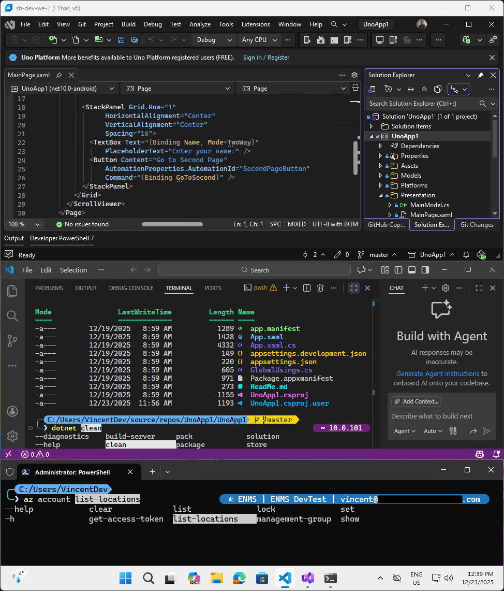

# azure-uno-dev-vm

> Quickly create secure, performant Windows Azure Virtual Machines for developing Microsoft Azure + Uno Platform solutions with .NET

What do you get?
- Complete instructions to create secure, fast Azure Virtual Desktop Windows 11 VMs - including multiple Azure regions
- An easy to customize, idempotent installation script to set up a VM for Azure and Uno Platform development with .NET
- Research notes on selecting the right VM size for near-desktop performance and for selecting the right Microsoft VM service and RDP client

 
_Windows App with Azure VM with Visual Studio 2026 with Uno Platform, VS Code with terminal icons, prompt with path and branch, dotnet 10 tooltip and tab completion, Windows terminal with az tooltip and tab completion, and more..._

Read on for details, or [Get started now](#getting-started)

## Why use Azure Virtual Desktop for Azure development?

Developing on a desktop / laptop gives good performance and developer control at low cost, however:
- Security in an enterprise context can be at risk, or strict general purpose security policies interfere with development tasks.
- Stability tends to degrade over time as more software is installed, especially when researching and working on solutions with different tech stacks.
- Consistency across team members is hard to achieve, leading to "it works on my machine" issues and less local testing.

When developing Azure solutions, a good alternative is to use Windows virtual machines with [Azure Virtual Desktop](https://azure.microsoft.com/en-us/products/virtual-desktop) and the [Windows App](https://learn.microsoft.com/en-us/windows-app/overview) remote desktop client on Mac or Windows machines (see [Selecting a VM service and RDP client in the changing Microsoft VM ecosystem](#selecting-a-vm-service-and-rdp-client-in-the-changing-microsoft-vm-ecosystem))

- Performance is close to a fast desktop machine when using the right VM size (see [VM size performance](#vm-size-performance))
- Developer control is unfettered
  - Each VM is personal
  - The dev has local admin rights on their VMs
  - General purpose desktop/laptop security policies do not interfere
- Costs are limited to actual usage
  - Azure Virtual Desktop automatically starts VMs when users connect
  - VMs are scheduled to be deallocated daily after working hours
  - Devs have control to deallocate their VMs earlier when not needed
- Security is ensured without complexity
  - Users authenticate to AVD and to the VM with Entra ID SSO - use MFA, no local accounts
  - VMs are not directly accessible from the internet - only through Azure Virtual Desktop
  - Aspire can be used to test the Azure solution on the VM, while only CI/CD has access to deploy to Azure.
- Stability and consistency become easy
  - The consistent begin state provided by the known VM image allows to maintain a simple scripted installation of required software and configuration.
  The installation script is idempotent, so it can be re-run as needed to fix issues or to update the VM.
  - Making a new VM in Azure Virtual Desktop is quick and easy, allowing to start fresh when needed, or to create multiple machines per developer to work with products with differing tech stacks.

The installation script automates setting up your development VM; the following section lists what is installed and configured.

## Automated development software installation and configuration

> Current version: 2025-12-23

The Powershell install script for the Windows 11 VM image is idempotent (so you can run it as often as you want), uses mostly WinGet, and ensures below is installed and configured:

- PowerShell 7 or later (default for Windows 11 is still PowerShell 5)

- If needed, resizes the OS drive to use all available space  
  (when you specify a larger size disk in Azure VM, the disk image is not automatically expanded)

- WSL2 (for use by Docker Desktop)

- Docker Desktop

- Azure CLI

- Git for Windows incl Git Credential Manager

- Azure Storage Explorer

- Aspire CLI

- Visual Studio Enterprise 2026 with required workloads and extensions (uses .vsconfig, easy to modify)
  - Workloads:
    - ASP.NET and web development
    - Azure and AI development
    - .NET Multi-platform App UI development
    - .NET desktop development
  - Extensions:
    - Uno Platform

- Visual Studio Code with extensions (uses a text file with extensions, easy to modify)
  - Extensions:
    - GitHub CoPilot
    - C# Dev Kit
    - PowerShell

- Uno.Check dotnet tool.  
  The tool is installed and ensures all prerequisites for targets Desktop, WASM, iOS and Android (easy to modify with command-line parameters)

- Trust .NET HTTPS dev certificate

- Accept Android SDK licenses.  
  This works around an issue where VisualStudio Android builds fail and the built-in license accept does not work.

- Oh-My_POSH powershell prompt plus CascadiaMono font to display prompt & terminal icons

- PowerShell TerminalIcons

- PowerShell profile configuration
  - .NET 10 CLI tab completion
  - AZ tab completion
  - Custom Oh-My_POSH theme `atomic-min-dotnet-git-az` with:  
    - Simplified 2-line prompt based on atomic theme look, with full current path on the first prompt, plus the current Git branch (only when in a repo). The second line has the full console width available for what you type.
    - Tooltip for AZ that shows the current Entra directory name, Azure subscription name and user - only when you are typing an AZ command.
    - tooltip for dotnet that shows the .NET version - only when you type a dotnet command
  - Terminal Icons enabled

## Getting started

Follow the instructions in [Azure-Virtual-Desktop.md](/src/Azure-Virtual-Desktop.md) to create and configure secure, performant Azure Virtual Desktop Windows 11 VMs for Azure and Uno Platform development with .NET

## Customizing

The installation script files are in the [src/azure-uno-dev-vm-windows](src/azure-uno-dev-vm-windows) folder;
you can modify them to suit your needs:

| File | What can be modified |
| --- | --- |
| [Install.ps1](src/azure-uno-dev-vm-windows/install.ps1) | Which software to install, Uno.Check parameters to select supported target platforms |
| [.vsconfig](src/azure-uno-dev-vm-windows/.vsconfig) | Visual Studio workloads and extensions to install. You can export this file from an existing installation with the Visual Studio Installer. |
| [vscode-extensions.txt](src/azure-uno-dev-vm-windows/vscode-extensions.txt) | VS Code extensions to install |
| [configure-powershell-profile.ps1](src/azure-uno-dev-vm-windows/configure-powershell-profile.ps1) | PowerShell profile configuration |
| [atomic-min-dotnet-git-az.omp.json](src/azure-uno-dev-vm-windows/atomic-min-dotnet-git-az.omp.json) | Oh-My-POSH theme customization |

After modifying installation script files, replace the [src/azure-uno-dev-vm-windows.zip](src/azure-uno-dev-vm-windows.zip) file with the zipped [src/azure-uno-dev-vm-windows](src/azure-uno-dev-vm-windows) folder. 
The [developer VM readme](/src/azure-uno-dev-vm-windows/Readme.md) contains a link to this ZIP file; the developer downloads this file to the VM to install it.

## Research notes

Some learnings from the research that resulted in this repo

### Selecting a VM service and RDP client in the changing Microsoft VM ecosystem

> **TL;DR** The best fit for developing Azure solutions in VMs is [Azure Virtual Desktop](https://azure.microsoft.com/en-us/products/virtual-desktop) accessed via the [Windows App](https://learn.microsoft.com/en-us/windows-app/overview).

#### RDP client options

The [Windows App](https://learn.microsoft.com/en-us/windows-app/overview) is positioned to replace the older Microsoft remote-desktop clients, and offers better UX like dynamic resolution (no scrollbars or sizing) and multi-monitor, on multiple platforms including Windows and Mac. Development on the older Microsoft remote-desktop clients seems to have halted.

#### VM service options

- Plain [Azure VM](https://azure.microsoft.com/en-us/products/virtual-machines)'s with [Azure Bastion](https://learn.microsoft.com/en-us/azure/bastion/bastion-overview) for secure access

  This has a subpar UX on Windows clients: the [Windows App](https://learn.microsoft.com/en-us/windows-app/overview) says _"Looking for connection to a remote PC? It's coming soon to Windows App"_ but it's not there yet and no ETA known. So you have to use the classic `MSTSC` client on Windows, which does not support dynamic resolution or multi-monitor (note that the Windows Remote Desktop app on Mac does support dynamic resolution - a weird state of affairs where Microsoft software has a better UX on Mac than on Windows).

- [Microsoft Dev Box](https://azure.microsoft.com/en-us/products/dev-box) states _"Capabilities of Microsoft Dev Box are transitioning to Windows 365"_ and no longer accepts new customers

- [Windows 365](https://www.microsoft.com/en-us/windows-365) cloud PC's

  This is a viable option, but has limitations:
  
  - The VM's do not run in your solution's Azure tenant / Entra Id directory, which means for Azure development that you cannot use [managed identities](https://learn.microsoft.com/en-us/entra/identity/managed-identities-azure-resources/overview) to let your VM's securely access your Azure solution resources.
  - Windows 365 offers limited options to increase cloud PC performance for a specific workload - only vCPU count / RAM size / storage size and GPU, but no options like VM CPU type / speed or disk performance, which are key for developer workload performance (see [VM size performance](#vm-size-performance)).

- [Azure Virtual Desktop](https://azure.microsoft.com/en-us/products/virtual-desktop)

  AVD adds a security and management layer on top of [Azure VM](https://azure.microsoft.com/en-us/products/virtual-machines)'s, while still exposing the full Azure VM management functionality and options. It adds Entra Id SSO in the VM and VM start on connect, and is supported by the [Windows App](https://learn.microsoft.com/en-us/windows-app/overview) (inc. dynamic resolution and multiple monitor support).

### VM size performance

> **TL;DR** use a last generation F series VM size, with the same number of cores as your reference machine, to get comparable perf

To compare VM performance to a desktop dev machine, I timed builds (initial, incremental and rebuild) of the default Uno Platform solution wizard project (which targets .NET 10 Desktop, WASM, iOS and Android) in Visual Studio 2026.

| Machine | Initial build | Minimal change build | Rebuild |
| --- | --: | --: | --: |
| Desktop | 1m 33s | 9s | 52s |
| D8as_v6 | 2m 23s | 15s | 1m 12s |
| F16as_v6 | 1m 48s | 11s | 57s |
| FX4mds_v2 | 5m | 46s | 2m 36s |

Desktop: AMD Ryzen 9 5950X, 16 cores, boosting ~4.35 GHz, 32 GB RAM, NVMe SSD

When using a latest generation VM size D8as_v6, which has 4 real cores (8 logical) and 32 GB RAM with a premium NVMe SSD, 
the build times prove to be CPU limited, and about 50% - 70% slower than the desktop.

While the D series are general purpose, the F series are compute optimized - a better match for our use case.
The D series simulate 2 logical cores for each physical one, but the F series maintain a 1 on 1 ratio.

When using a F16as_v6 VM size, 16 cores, boosting ~3.7 GHz, Premium NVMe SSD, the perf is close to the desktop.

Wnen using an FX series, which has higher clock CPU but less cores, the VM was 2.5 - 4 times slower than the desktop; clearly not a good fit.
